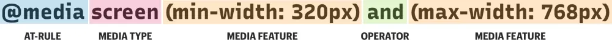

# Introduction to CSS:
## What is CSS?
CSS (Cascading Style Sheets) is used to style and lay out web pages — for example, to alter the font, color, size, and spacing of your content, split it into multiple columns, or add animations and other decorative features. This module provides a gentle beginning to your path towards CSS mastery with the basics of how it works, what the syntax looks like, and how you can start using it to add styling to HTML.

1. ### Getting started with CSS:
    - **Box Model**: Everything displayed by CSS is a box. Understanding how the CSS Box Model works is therefore a core foundation of CSS.

        

        - Explanation of the different parts:

            Content - The content of the box, where text and images appear.

            Padding - Clears an area around the content. The padding is transparent.

            Border - A border that goes around the padding and content.

            Margin - Clears an area outside the border. The margin is transparent.

    - **Selectors**: To apply CSS to an element you need to select it. CSS provides you with a number of different ways to do this, and you can explore them in this module.

        


    - **Color**: There are several different ways to specify color in CSS. In this module we take a look at the most commonly used color values.

        - Numeric colors #: It is very likely that your first exposure to colors in CSS is via numeric colors. We can work with numerical color values in a few different forms.

        Hex colors #: Hexadecimal notation (often shortened to hex) is a shorthand syntax for RGB, which assigns a numeric value to red green and blue, which are the three primary colors.

        ``` 
        h1 {
            color: #b71540;
        }

        ```
        
    - **Flexbox**: Flexbox is a one-dimensional layout method for laying out items in rows or columns. Items flex to fill additional space and shrink to fit into smaller spaces. This article explains all the fundamentals. After studying this guide you can test your flexbox skills to check your understanding before moving on.

        - What can you do with a flex layout? #: Flex layouts have the following features, which you will be able to explore in this guide.

        - They can display as a row, or a column.
        - They respect the writing mode of the document.
        - They are single line by default, but can be asked to wrap onto multiple lines.
        - Items in the layout can be visually reordered, away from their order in the DOM.
        - Space can be distributed inside the items, so they become bigger and smaller according to the space available in their parent.
    Space can be distributed around the items and flex lines in a wrapped layout, using the Box Alignment properties.
    The items themselves can be aligned on the cross axis.


    - **CSS Media Queries**: Media queries can modify the appearance (and even behavior) or a website or app based on a matched set of conditions about the user’s device, browser or system settings. CSS Media queries are a way to target browser by certain characteristics, features, and user preferences, then apply styles or run other code based on those things. Perhaps the most common media queries in the world are those that target particular viewport ranges and apply custom styles, which birthed the whole idea of responsive design

        ```css
        <style>
        /* When the browser is at least 600px and above */
            @media screen and (min-width: 600px) {
                .element {
                    /* Apply some styles */
                }
            }

            /* Viewports between 320px and 480px wide */
            @media only screen and (min-device-width: 320px) and (max-device-width: 480px) {
                .card {
                    background: #bada55;
                }
            }
        </style>
        ```
        - Anatomy of a Media Query

        

        <details>
        <summary>@media</summary>
        
        The first ingredient in a media query recipe is the @media that a site is viewed with, what features that media type supports, and operators that can be combined to mix and match simple and complex conditions alike.

        ### Some Code
        ```css
            @media [media-type] ([media-feature]) {
                /* Styles! */
            }
        ```
        </details>

        <details>
        <summary>Media types</summary>
        
        What type of media are we trying to target? In many (if not most) cases, you’ll see a screen value used here, which makes sense since many of the media types we’re trying to match are devices with screens attached to them.

        But screens aren’t the only type of media we can target, of course. We have a few, including:

        - **all**: Matches all devices
        - **print**: Matches documents that are viewed in a print preview or any media that breaks the content up into pages intended to print.
        - **screen**: Matches devices with a screen

        ### Some Code
        ```css
            @media screen {
                /* Styles! */
            }
        ```
        </details>
        
        
        <details>
        <summary>Media features</summary>
        
        Once we define the type of media we’re trying to match, we can start defining what features we are trying to match it to. We’ve looked at a lot of examples that match screens to width, where screen is the type and both min-width and max-width are features with specific values.

        </details>

        <details>
        <summary>Operators</summary>
        
        Media queries support logical operators like many programming languages so that we can match media types based on certain conditions. The @media rule is itself a logical operator that is basically stating that “if” the following types and features are matches, then do some stuff.


        ### and (operator): 
        - We can use the and operator if we want to target screens within a range of widths:

        ```css
        /* Matches screen between 320px AND 768px */
            @media screen (min-width: 320px) and (max-width: 768px) {
                .element {
                    /* Styles! */
                }
            }
        ```

        ### or (or comma-separted): 
        - We can also comma-separate features as a way of using an or operator to match different ones:

        ```css
            /* 
            Matches screens where either the user prefers dark mode or the screen is at least 1200px wide */
            @media screen (prefers-color-scheme: dark), (min-width 1200px) {
                .element {
                    /* Styles! */
                }
            }
        ```
        </details>