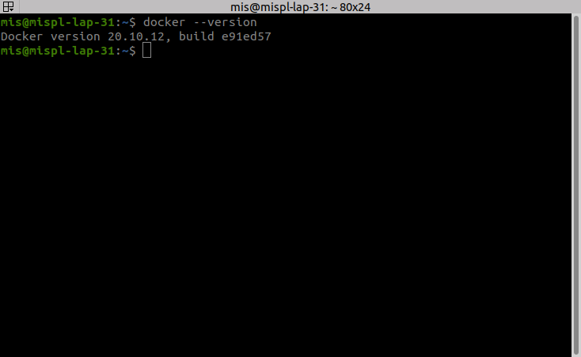
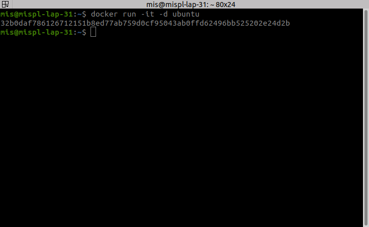
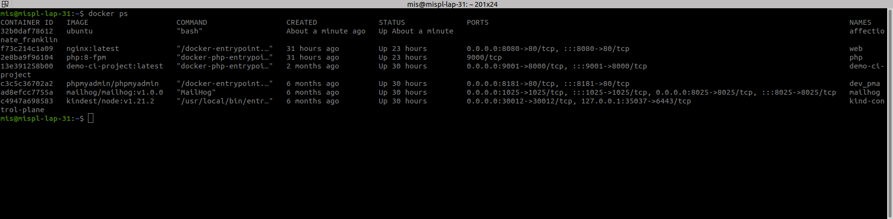
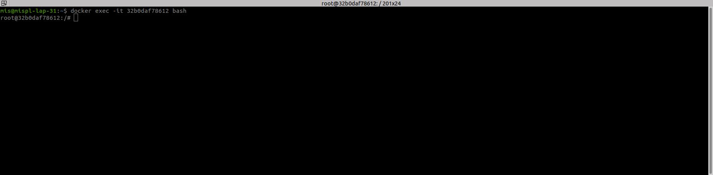
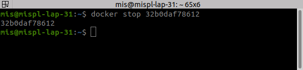
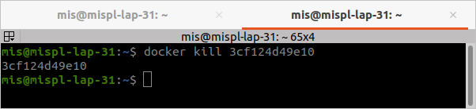
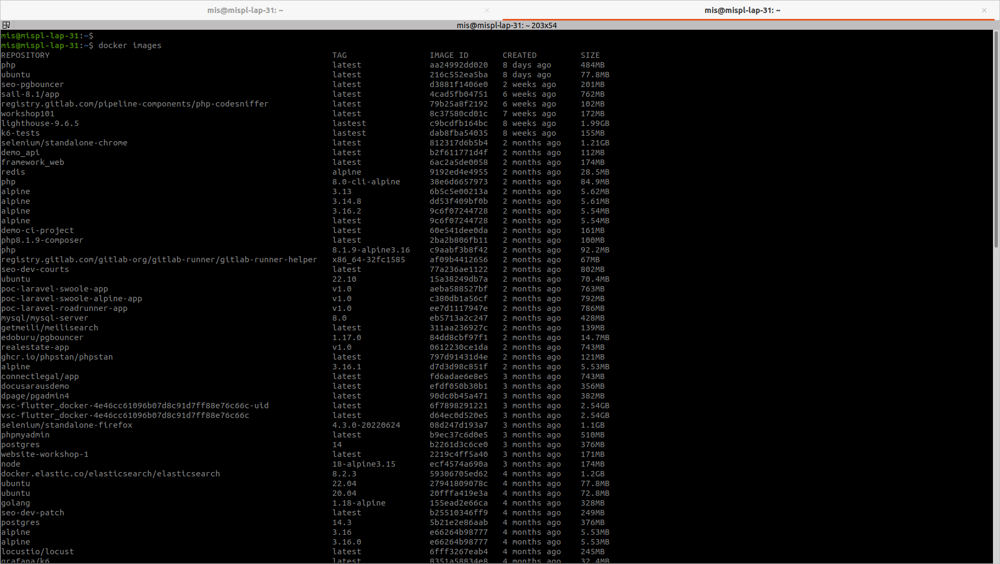
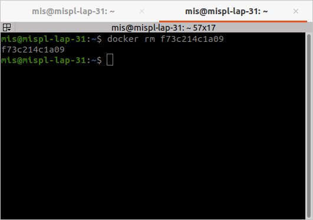
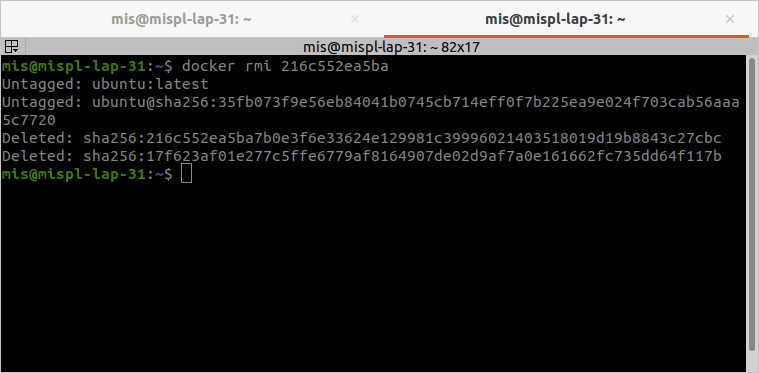
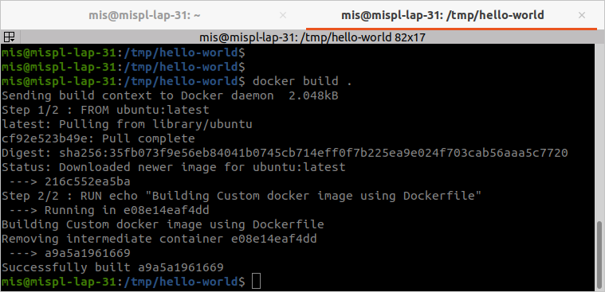

# Docker Commands

### 1.) docker –version
  - This command is used to get the currently installed version of docker

  

### 2.) docker pull
  - Usage: docker pull `<image name>`
    - This command is used to pull images from the docker repository(hub.docker.com)

  

### 3.) docker run
  - Usage: docker run -it -d `<image name>`
    - This command is used to create a container from an image.

  

### 4.) docker ps
  - This command is used to list the running containers.

  

### 5.) docker exec
  - Usage: docker exec -it `<container id>` bash
    - This command is used to access the running container.

  

### 6.) docker stop
  - Usage: docker kill `<container id>`
    - This command stops a running container.

  

### 7.) docker kill
  - Usage: docker kill `<container id>`
    - This command kills the container by stopping its execution immediately. The difference between ‘docker kill’ and ‘docker stop’ is that ‘docker stop’ gives the container time to shutdown gracefully, in situations when it is taking too much time for getting the container to stop, one can opt to kill it.

  

### 8.) docker images
  - This command lists all the locally stored docker images.

  

### 9.) docker rm
  - Usage: docker rm `<container id>`
    - This command is used to delete a stopped container.

  

### 10.) docker rmi
  - Usage: docker rmi `<image-id>`
    - This command is used to delete an image from local storage.

  

### 11.) docker build
  - Usage: docker build `<path to docker file>`
    - This command is used to build an image from a specified docker file.

  

### What is Docker Compose

Developing applications using Docker can become challenging when juggling multiple services and containers.<br>
Docker Compose is the tool that will help you run multi-container application environments.<br>

An application can consist of multiple containers running different services. It can be tedious to start and manage containers manually, so Docker created a useful tool that helps speed up the process - Docker Compose.<br>

Docker Compose works by applying rules defined in a docker-compose.yaml file. The YAML file configures the application's services and includes rules specifying how you want them to run. With the file in place, you can start, stop, or rebuild all the services using a single command. Additionally, you can check the status of a service, display log outputs, and run one-off commands.
### Docker Compose Basic Commands

```commandline
Command	Description
docker-compose --help	show help, usage instructions for and arguments for the docker-compose command
docker-compose build	look for all services containing the build: statement in the docker-compose.yml file and run a docker build for each one
docker-compose run	run a one-time command against a service
docker-compose up	build, (re)create, start, and attach to containers for a service
docker-compose -f 	specify the location of a docker-compose configuration file by adding the -f flag
docker-compose start	start existing containers for a service
docker-compose stop	stop running containers (without removing them)
docker-compose pause	pause running containers of a service
docker-compose unpause	unpause paused containers of a service
docker-compose down	stop containers (and remove containers, networks, volumes, and images)
docker-compose ps	list containers within the docker-compose configuration file
docker-compose images	list images used by created containers
docker-compose ls	list running Compose projects
```
create a file named docker-compose.yaml in the same folder that you have cloned with the following contents.
```
version: "3.7"
services:
  web:
    image: nginx:latest
    container_name: web
    ports:
      - "8080:80"
    volumes:
      - ./src:/code
      - ./site.conf:/etc/nginx/conf.d/default.conf
    links:
        - php

  php:
    image: php:8-fpm
    container_name: php
    volumes:
      - ./src:/code

```


## Running the Application:

From the directory where `docker-compose.yaml` file is present, run `docker-compose up`. This will bring up both the containers and the app will be accessible from `http://localhost:8080`.

Here you will notice that if the images are not available on your local machine then it will try to pull from docker hub.

### web service:

This service will run web container from nginx image. 
  - NGINX is open source software for web serving, reverse proxying, caching, load balancing, media streaming, and more. It started out as a web server designed for maximum performance and stability.

### php service

This service will run php container from php8-pfm image.
  - (PHP: Hypertext Preprocessor) An extremely popular scripting language that is used to create dynamic Web pages. PHP code is embedded within HTML pages for server side execution.
  ```
  <!DOCTYPE html>
    <html>
        <head>
            <title>Example</title>
        </head>
        <body>

            <?php
                echo "Hi, I'm a PHP script!";
            ?>

        </body>
    </html>
  ```
